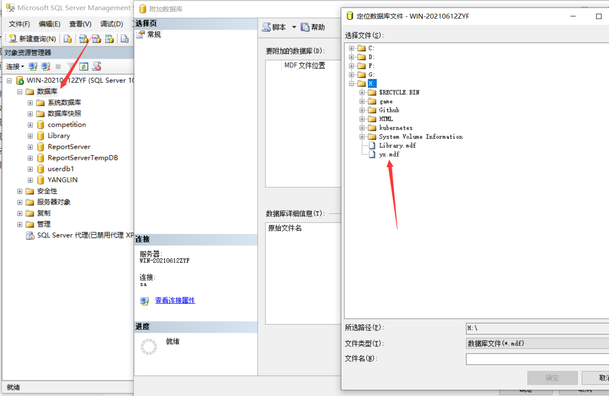
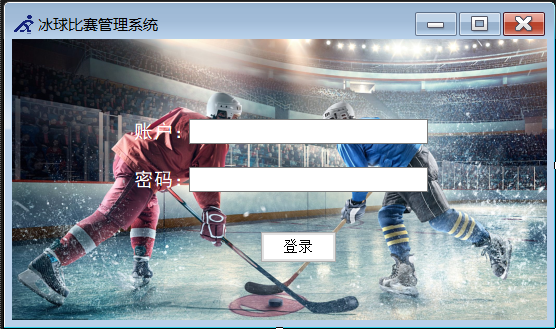
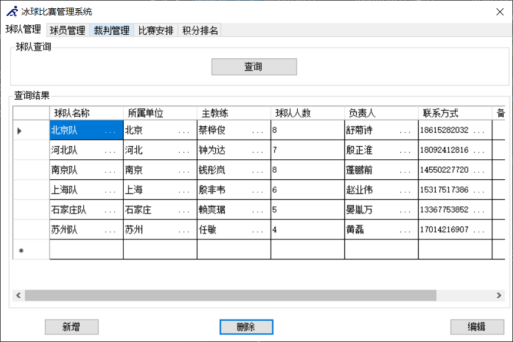
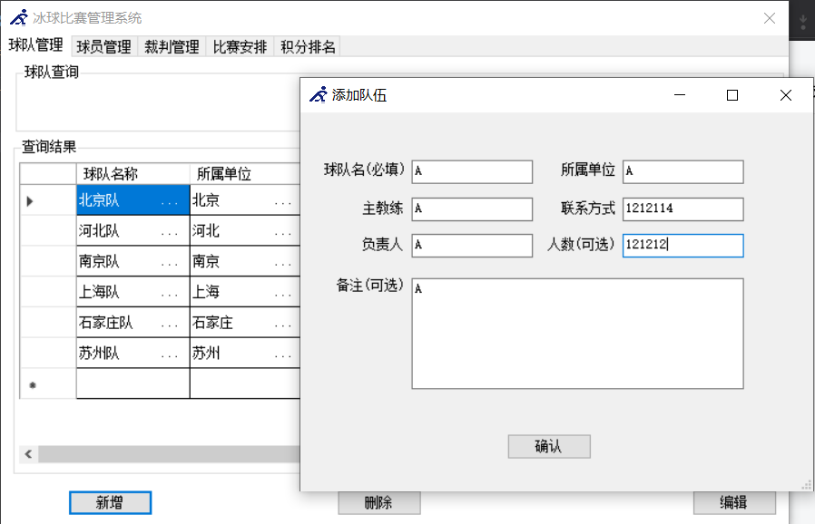
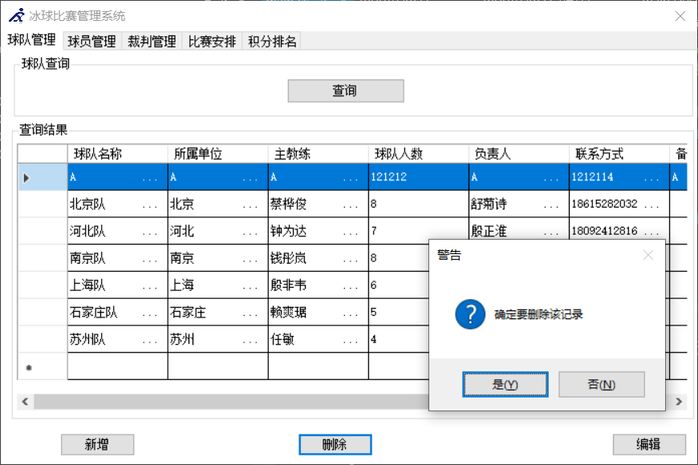
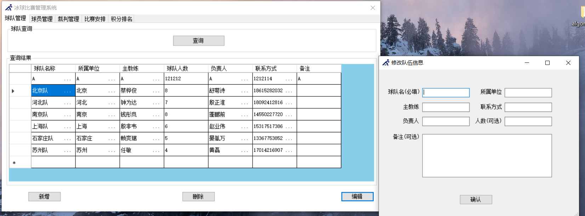
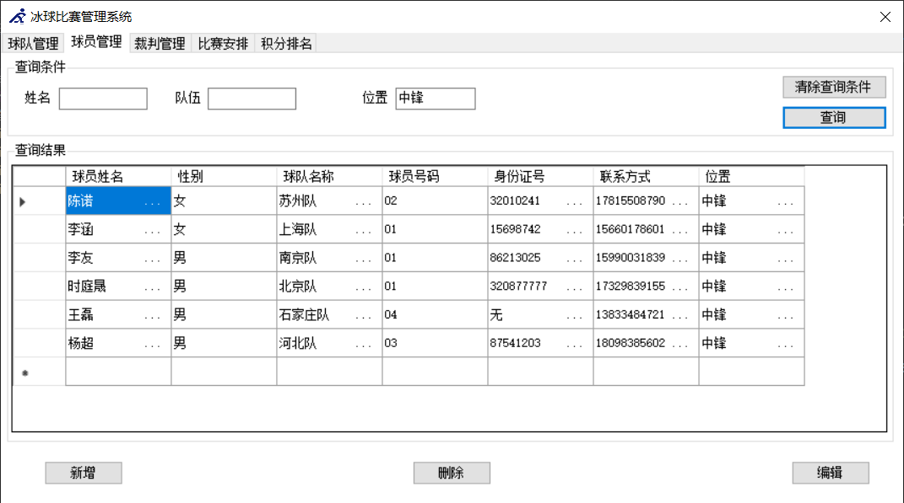
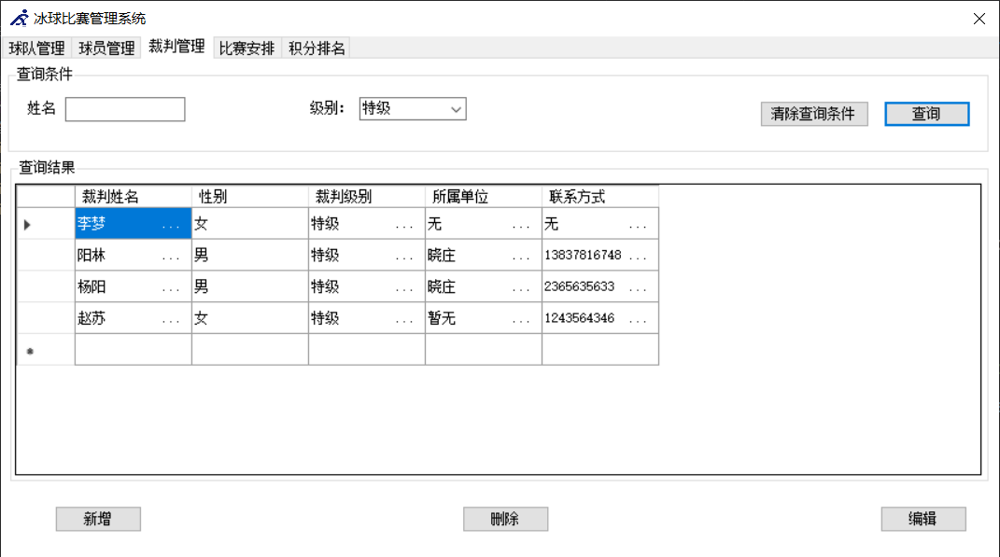
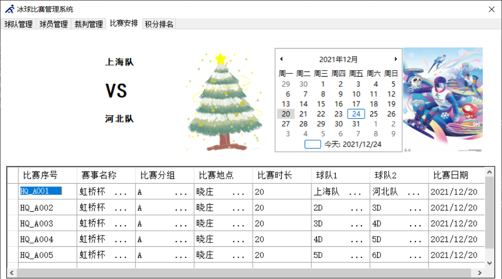
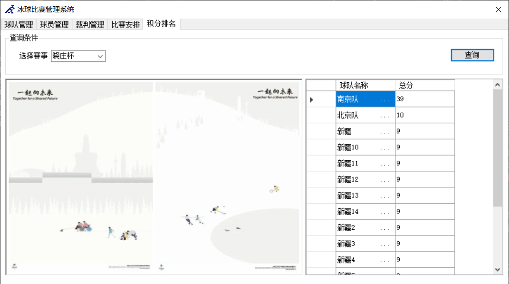

### Sqlserver数据库分离打包操作

分离出来后断开连接，复制.mdf .ldf到git仓库，附加操作再形成本地数据库

### 登录

附加数据库后建立sql验证，uid=sa，psd=123456

### 球队管理

#### 查询

#### 添加

#### 删除

#### 修改

### 球员管理

### 裁判管理

### 比赛安排

点击日期下方可以显示当天比赛，点击行，可以看到上方这场比赛的两个队伍

### 积分排名

### 致谢

